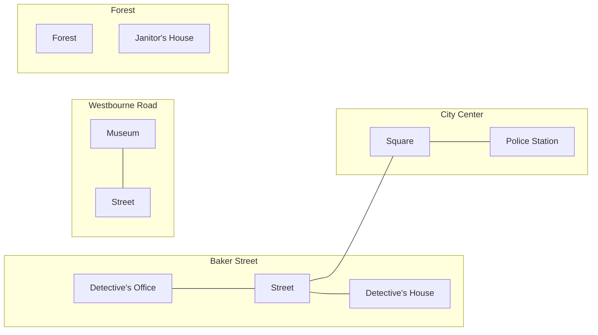
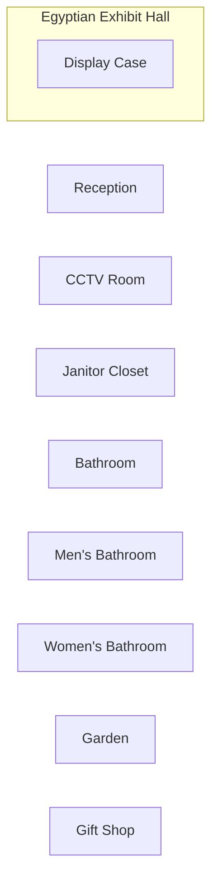

# Story

Welcome to "The Case of the Missing Artifact", a text game about detective work. In this game, you play the role of a seasoned detective tasked with solving a mysterious theft of a valuable artifact from a museum.

You receive a call from the museum director who informs you that the prized artifact, an ancient Egyptian statue, has been stolen from the museum's exhibit hall. The museum staff has no leads, and the local police are overwhelmed with other cases. You're the last hope to find the thief and retrieve the statue.

Your first task is to visit the museum and investigate the crime scene. As you arrive, you meet with the museum's head of security, who provides you with a detailed description of the theft. You learn that the thief broke into the museum during the night and bypassed the security system, making off with the statue unnoticed. You notice that there are no signs of forced entry or any other signs of a struggle. However, there are a few clues to help you get started:

Footprints: You notice a set of footprints leading away from the exhibit hall. They appear to be the same size as an average adult male's.

Toolmarks: You spot a few tool marks on the display case where the statue was kept. It looks like the thief used some kind of tool to break the case.

CCTV footage: You review the CCTV footage from the museum's security cameras, but it doesn't provide any clear visuals of the thief's face. However, you do notice that the thief was wearing a distinctive red jacket.

Museum Staff: You speak with the museum staff, and they inform you that a new security guard was recently hired to replace an employee who retired. They also mention that one of the janitors has been acting suspiciously lately.

Now it's up to you to put the pieces of the puzzle together and solve the case. You have to interview the suspects, gather evidence, and solve the mystery before the thief escapes with the artifact.

As you investigate further, you discover that the new security guard, Mike, has a criminal record for theft and has been fired from his previous job for stealing. You also find out that the janitor, Tom, has been struggling with financial problems and has a gambling addiction.

You start to put the clues together and realize that the thief must have used Mike's security card to enter the museum and bypass the security system. You also suspect that Tom may have helped the thief by providing him with information about the museum's layout and security system.

As you confront the suspects, they deny any involvement in the theft. However, you're able to find the stolen artifact hidden in Tom's backyard, along with a red jacket that matches the one seen in the CCTV footage.

You have solved the case! You arrest Tom and Mike and return the artifact to the museum, where it is displayed once again for all to see. Congratulations, detective, on a job well done!

# Map

## City


## Museum


## Office
```mermaid
flowchart LR

```

## Detective's Home
```mermaid
flowchart LR
```
